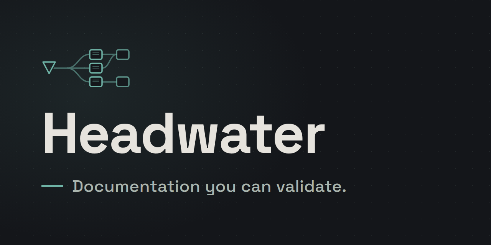

**Documentation rots because nothing holds it accountable.** Headwater types your corpus, checks it as a graph, and accounts for every file it saw. Nothing else can answer *"is this corpus still true?"*

[](https://github.com/headwater-ai/headwater/actions/workflows/ci.yml) [](https://github.com/headwater-ai/headwater/releases/latest) [](LICENSE) [](https://deepwiki.com/headwater-ai/headwater)

**Start here: [Your first governed corpus](docs/tutorials/your-first-governed-corpus.md).** Sixteen steps from an empty directory to a passing check, and it teaches the model rather than the commands. Every step states what you should now see, and `sh .claude/tutorial/fixtures.sh` runs the page against the engine in CI so that no output block on it can go stale quietly. That page, and the rest of the `docs/` tree, is rendered at <https://headwater.tools/>. The specification itself is indexed at [`docs/spec/README.md`](docs/spec/README.md), which `headwater generate` writes from the documents themselves in the reading order this corpus derives from its own relations.

## Obtaining a named version

**Download the binary. You need no Rust toolchain.** Every engine release carries a static Linux x86_64 archive and a macOS arm64 archive. The block below installs `v0.2.1` on Linux into `~/.local/bin`. On macOS on Apple silicon, put `aarch64-apple-darwin` where the block says `x86_64-unknown-linux-musl`.

```
mkdir -p ~/.local/bin
curl -fsSLO https://github.com/headwater-ai/headwater/releases/download/v0.2.1/headwater-v0.2.1-x86_64-unknown-linux-musl.tar.gz
tar -xzf headwater-v0.2.1-x86_64-unknown-linux-musl.tar.gz -C ~/.local/bin headwater
```

Each archive has a `.sha256` file beside it on the release, which `sha256sum -c` reads, and `shasum -a 256 -c` on macOS. The archive holds the `headwater` binary and the license, and nothing else. It does not get you `taxonomy-source`, and the taxonomy paragraphs below say how to fetch it.

**The alternative, if you already have a Rust toolchain.** Every workspace crate is on crates.io, published in dependency order by `.github/workflows/publish-crates.yml`.

```
cargo install headwater-cli
```

The command needs nothing this repository ships: no clone, no toolchain floor beyond what `cargo` itself resolves from the crate's declared `rust-version`. It gets you the `headwater` binary alone, at whatever the newest published version is.

**A fixed version built from source, with the taxonomy package beside it.** `v0.2.1` is the newest tagged release, and the block below builds it from source. It needs a Rust toolchain at **1.91 or later**, a floor `engine/README.md` explains and `engine/Cargo.toml` declares.

```
git clone https://github.com/headwater-ai/headwater.git
cd headwater
git checkout v0.2.1
cargo build --release -p headwater-cli --manifest-path engine/Cargo.toml --locked
```

The binary lands at `engine/target/release/headwater`, and `headwater --version` prints the number the tag names. The taxonomy package is verified through its own tag namespace rather than through this engine release, because an engine release states no digest for the package its tree happens to carry. [The release for `taxonomy/headwater-standard/v4.2.0`](https://github.com/headwater-ai/headwater/releases/tag/taxonomy/headwater-standard/v4.2.0) states `sha256:961ecf2ae2c3c74f251adea575d16b2efda37d9a7fb10d2889e12bb77f4c2eb5`: the value of the `release.digest` field inside `.headwater/packages/headwater-standard/release.yml` in the tree that tag names. It is not what `sha256sum` prints for that file, because the field covers the files the record lists and cannot cover the record itself.

The binary alone gets you the rest of the way there, with nothing else required: fetch that release's tree by whatever route your organization allows — the GitHub release page, a mirror, an air-gapped copy — into `.headwater/packages/headwater-standard`, then run `headwater taxonomy vendor .headwater/packages/headwater-standard --expect <digest>` directly. A matching digest exits 0 and reports the version and the file count, and a digest that does not match exits 1, names both values and writes nothing. `tools/headwater-bootstrap.sh --tag taxonomy/headwater-standard/v4.2.0 --expect <digest>` is a convenience over that same verb for a reader who is fine pulling straight from GitHub: it fetches the tree into a scratch directory and runs `vendor` over it, with no clone at all. The tutorial's step 3 runs the same two arguments, through the script.

**An engine tag pins whatever `headwater/standard` version happened to ship with it, which is not always the newest one.** An engine tag is cut when the engine changes, not when the taxonomy does, so the version a `v<n>` tag carries can lag behind the version `taxonomy-source/headwater-standard/package.yml` states on the default branch for as long as nobody cuts the next engine release — [#757](https://github.com/headwater-ai/headwater/issues/757) is that gap, and it is a gap in the route rather than in the package. `taxonomy/headwater-standard/v<version>` is a second tag namespace, distinct from `v<version>` so the two never collide, cut independently by whoever maintains `headwater/standard` whenever they choose to publish a fixed version of it alone: no engine version bump and no engine tag required. `.github/workflows/release-taxonomy.yml` ([#760](https://github.com/headwater-ai/headwater/issues/760)) runs `headwater taxonomy publish` against `taxonomy-source/headwater-standard`, and attaches `headwater-standard-<version>.zip` to the tag's GitHub release, with the `release.digest` value printed in the release notes. `tools/headwater-bootstrap.sh --tag taxonomy/headwater-standard/v<version> --expect <digest>` fetches it exactly the way it fetches an engine tag, because it reads whatever source tree a tag names and does not care which workflow cut it. [`taxonomy/headwater-standard/v4.2.0`](https://github.com/headwater-ai/headwater/releases/tag/taxonomy/headwater-standard/v4.2.0) is the first release this route ever cut, and the tutorial's step 3 fetches it.

**What each engine release carries.** `.github/workflows/release.yml` attaches three archives to every tag whose name starts with `v`, each beside a checksum for `sha256sum -c`, and each archive holds the `headwater` binary and the license. `headwater-<tag>-x86_64-unknown-linux-musl.tar.gz` is a static Linux build that needs no particular C library, beside `headwater-<tag>-x86_64-unknown-linux-musl.tar.gz.sha256`. `headwater-<tag>-aarch64-apple-darwin.tar.gz` is for macOS on Apple silicon, beside `headwater-<tag>-aarch64-apple-darwin.tar.gz.sha256`. `headwater-<tag>-x86_64-unknown-linux-gnu.tar.gz` is `x86_64` Linux built on `ubuntu-24.04`, so it needs glibc 2.39 or later, beside `headwater-<tag>-x86_64-unknown-linux-gnu.tar.gz.sha256`. The workflow runs the musl and the macOS archives on a host that did not build them and has no Rust toolchain, and it creates no release until both run. `v0.2.0` is the first tag that carries all three. `v0.1.2` carries the glibc archive alone, and `v0.1.1` carries none after its release collided with an immutable release object. [The releases page](https://github.com/headwater-ai/headwater/releases) is where you see which tags carry a binary.

The tutorial installs from the same release download as the first block above, and it names `cargo install` only as the alternative. It pins the version it downloads, and CI runs every other block of the tutorial against the engine on the default branch.

## Status

> **The engine runs, and two of its layers are unfinished.** This repository types its own corpus, checks it on every commit, and scaffolds, explains, routes, generates and exports it. Distribution and the measurement layer are the unfinished layers, and the canonical taxonomy library, ecosystem tooling, taxonomy expressiveness and this first release are the rest of what is still open. Every efficacy claim in this repository is still marked unmeasured.

## What problem this solves

Specs drift from code, rationale evaporates, standards multiply and contradict each other, and the AI assistants now reading that documentation as context inherit every one of those faults — silently, and at scale.

The usual answers are a style guide (unenforced), a wiki (unstructured), or a static-site generator (renders whatever you feed it). None of them can answer *"is this corpus still true?"*, because none of them know what kind of document anything is.

Headwater's premise: **make the structure of the corpus a machine-readable contract**, then derive everything else from it — validation, navigation, templates, AI instruction context, publishing, and the evidence that the whole thing is working.

## The three commitments

1. **Taxonomy is data.** What shelves exist, what document kinds live on them, what metadata they carry, what voice and lifecycle they obey, and how they may reference each other — all declared in one versioned schema. Two organizations with different documentation cultures run the same engine over different taxonomies. Customizing the taxonomy never means forking the tooling.

2. **The corpus is a graph.** Documents are typed nodes; front-matter references are typed edges. Every validation rule is a constraint on that graph, every query is a traversal of it, and every derived artifact (indexes, site navigation, AI rules, agent context) is a projection of it.

3. **AI assistants are readers in their own right, and measured ones.** The corpus feeds agents at intent time, read time, write time, and review time — and the system probes whether that context actually changes agent behavior, rather than assuming it does.

## License

Code is licensed under the Apache License, Version 2.0. See [`LICENSE`](LICENSE) and [`NOTICE`](NOTICE).

The prose under `docs/` is licensed under Creative Commons Attribution 4.0 International. See [`docs/LICENSE`](docs/LICENSE). Code samples inside that prose stay under Apache-2.0, so copying an example into your own project carries no attribution obligation.

Contributions arrive under the [Developer Certificate of Origin](https://developercertificate.org/), with a `Signed-off-by` line and no contributor license agreement. [`CONTRIBUTING.md`](.github/CONTRIBUTING.md) states why. [`SECURITY.md`](.github/SECURITY.md) carries the disclosure process, and [`TRADEMARKS.md`](TRADEMARKS.md) states the trademark position, which is that there is no registered mark.

[Q11](docs/spec/09-decisions.md#q11--license-and-distribution-posture) records the reasoning, and the [first-contact evaluation](docs/evaluations/first-contact.md) carries the full argument. The design narrowed the field and did not choose within it: internal-only and source-available terms are refused by rulings the specification already made, and network copyleft is refused for the library that spec 6 requires. The choice among the terms that remained belongs to the owner, who made it on 2026-08-11.
