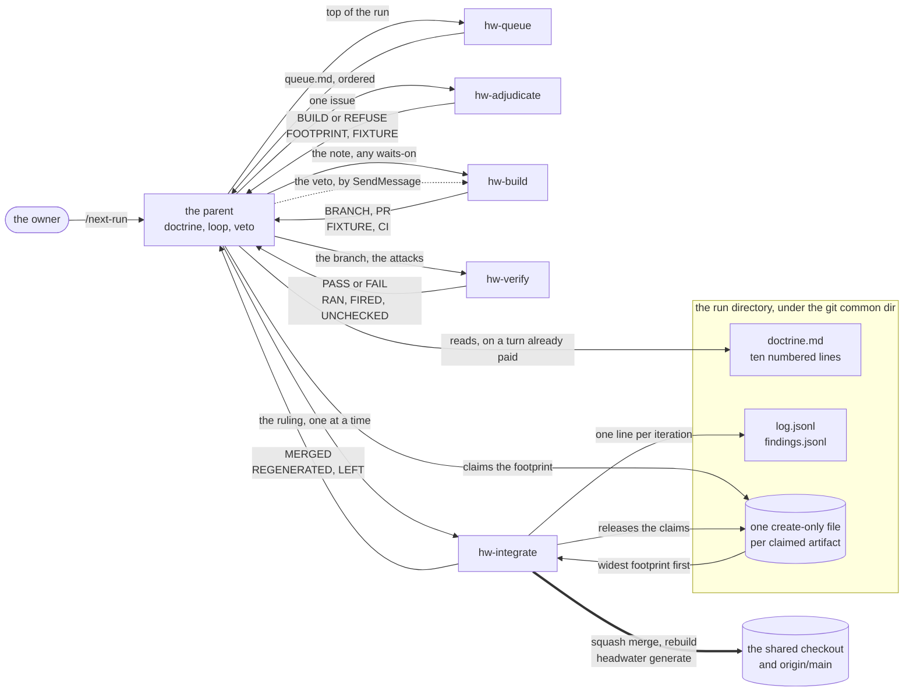

# 17 — Orchestration architecture

One parent, five stages, and a veto that never leaves the parent.

## What this part states, and what the evaluation holds

This part states the architecture of the build order as it stands. [The build order as a multi-agent system](../evaluations/the-build-order-as-a-multi-agent-system.md) is the evidence under it, and the two documents do different work. The evaluation is a point-in-time record. It holds what one twenty-hour run measured about its own orchestrator. It holds the cost model those measurements settle, what the design refused, and the numbers a later run answers to. It stands as written, and nothing edits it to match a definition that moved.

This part carries no run number, no session identifier and no measurement. It states what each participant owns, what each one may never do, and where each decision is taken. An edit to an agent definition is an edit to this part, because a definition is the implementation and this is the statement of it.

The reader outside this repository is an adopter who runs an agentic loop over a corpus of their own. What transfers is the shape rather than the issue list. One parent rules and never builds. Five stages each own one act. A unit of cost decides where a stage boundary goes. A coordination channel carries no authority at all.

## The topology

**A run is a tree and never a mesh.** Authority flows down from the parent, and a report flows back up. No stage instructs another stage. [HW-PD-0004](../process/decisions/0004-coordination-is-a-create-only-claim-and-authority-stays-on-the-tree.md) settles this on a live case. One session declined to edit a governed file on a peer session's reasoning, and that refusal was correct. A peer's message carries no owner authority. In a mesh, every agent adjudicates provenance on every message. On a tree, provenance is never in question.

**Two channels cross the tree sideways, and neither one carries a decision.** The first is the claim store. The adjudicator declares the artifact footprint of a change. The parent claims each artifact on a turn it already pays for. A second claimant records what it waits on rather than failing. The second channel is the merge order that follows from those claims. The integrator takes the widest footprint first, and it never merges a branch before every branch that branch waits on has merged and regenerated.

**Every stage is an agent definition, and each one loads fresh on every dispatch.** The parent dispatches by name and pastes nothing a definition already states. Each definition declares its own model in its own front matter, so a per-stage model choice is one line rather than a paragraph of prose. Each stage returns a fixed report block, so a parent that has compacted acts by matching a block rather than by recalling a rule.

**Two skills carry what more than one stage obeys.** [`hw-run-policy`](../../.claude/skills/hw-run-policy/SKILL.md) holds the standing rulings and the environment of a run, and every stage invokes it before it begins. [`hw-verification-bar`](../../.claude/skills/hw-verification-bar/SKILL.md) holds the adversarial checks and the review questions behind them. The parent chooses attacks from the bar, and the verifier runs them.

## Roles and responsibilities

### The parent

[`.claude/commands/next-run.md`](../../.claude/commands/next-run.md) is the entrypoint and the parent's whole doctrine. [`.claude/commands/next.md`](../../.claude/commands/next.md) runs one iteration over the same five definitions and the same two skills, at width one. There the merge belongs to the person in the session.

**The parent owns three things: the doctrine, the loop and the veto.** The doctrine is at most ten numbered lines and at most six hundred tokens. A run copies it into the run directory, so that a compacted parent acts from it alone. The loop dispatches the queue, fills the slots, and advances on each report. The veto is the merge decision, and it is the one judgment that never leaves the parent.

**The parent never builds, never merges by hand and never reads the board.** It runs no `gh` call and no `cargo build`. Pull request state arrives inside the verifier's report, and board state arrives as a queue file. Every build belongs to the integrator or to a worker's own worktree. [HW-PD-0003](../process/decisions/0003-a-dispatch-pays-when-it-retires-more-parent-turns-than-it-costs.md) is the rule under each of those refusals.

**The parent waits by ending its turn.** With agents in flight, an ended turn is the blocking wait, and each report wakes it. A check on a timer buys nothing and costs a turn at the parent's full context. Its prompt cache holds that context for an hour, so a report arrives warm whether or not the parent looked.

**The parent escalates to a person on two conditions and rules on everything else.** A redirect that changes milestone order and a decision that needs an owner rather than an answer both go to the human. [`headwater-product-owner`](../../.claude/agents/headwater-product-owner.md) reads the whole board and writes one ruling block for each decision the owner owes, and [`headwater-maintainer`](../../.claude/agents/headwater-maintainer.md) reports what a change left stale. Both propose, and neither accepts.

### The queue stage

[`.claude/agents/hw-queue.md`](../../.claude/agents/hw-queue.md) reads the whole issue list and the milestone list once, and writes an ordered file of eligible issues into the run directory.

**It owns the population and the order.** It applies the value rule, sorts a defect above everything else, and marks each candidate with the artifacts that change most likely regenerates. The parent then reads one report and never the board. A board dump read once is re-read on every later turn of the run.

**It never claims an issue and never edits the board.** A claim belongs to the construction stage, so that the claim is atomic and survives an agent that dies. A misfiled issue, a finished milestone or a missing label is a line in this stage's report. [`headwater-product-owner`](../../.claude/agents/headwater-product-owner.md) owns the structure of the board and never its scope.

### The adjudication stage

[`.claude/agents/hw-adjudicate.md`](../../.claude/agents/hw-adjudicate.md) settles whether one issue's premise still holds, before anything is built.

**It owns the premise, the footprint and the decisive fixture.** It writes a note for the construction stage, which starts near an empty context and reads nothing the adjudicator saw unless the note carries it. Its report is a fixed block of three lines: the verdict, the derived artifacts the change regenerates, and the decisive fixture. That fixture is the one test that would catch the thing the issue exists to prevent.

**Refusal is licensed in words, and a refusal is a completion rather than a failure.** [HW-PD-0002](../process/decisions/0002-adjudication-is-a-separate-stage-and-refusal-is-licensed.md) settles that this stage stands alone for exactly that reason. An agent handed a prescribed remedy implements the remedy and cannot find the error in it. An agent that first settles whether the premise holds can. A refusal has three kinds, and the parent rules on the kind rather than on the prose.

**It never builds and never edits the board.** Not a fixture and not a scaffold. The note says what to build, and the construction stage builds it.

### The construction stage

[`.claude/agents/hw-build.md`](../../.claude/agents/hw-build.md) builds one adjudicated issue in a worktree of its own and opens the pull request.

**It owns the branch, the commits and the pull request.** It claims the issue on the board before its first commit, because a board claim is atomic and needs no coordinator. It extends the contract, the decision clause or the case table the note names before it writes any implementation. It repairs its own red continuous-integration run before it reports.

**It never merges, never force-pushes and never touches the shared checkout.** The integrator alone writes `main`. A generating verb run in the shared checkout while a merge lands is the silent bad merge from the other direction.

**A `waits-on` line is the integrator's to honor rather than this stage's to build around.** Construction builds against `origin/main` as it stands. The integrator merges the awaited change first and rebases this branch behind it, and nothing rebases a branch whose agent is still running.

### The verification stage

[`.claude/agents/hw-verify.md`](../../.claude/agents/hw-verify.md) attacks one branch adversarially and returns a verdict that the parent rules on.

**It owns the attacks and the evidence, and never the ruling.** It resets a scratch worktree to the branch, runs the suite and the gates, and runs the attacks the parent chose from [`hw-verification-bar`](../../.claude/skills/hw-verification-bar/SKILL.md). Its block reports what fired, what held, and every claim in the build note it could not test.

**A verdict of `PASS` says what the verifier ran, and never that the branch is sound.** The line of unchecked claims is what makes a verdict readable, and a verdict that omits it is a verdict nobody can calibrate. The parent knows this when it rules.

**It edits nothing, and the tool list is the boundary.** The definition grants no `Edit` and no `Write`, because a verifier able to repair a branch verifies its own repair.

### The integration stage

[`.claude/agents/hw-integrate.md`](../../.claude/agents/hw-integrate.md) merges one ruled pull request, moves the shared checkout, rebuilds, regenerates, and writes back to the board.

**It is the sole owner of the shared checkout and of that checkout's engine target.** Depth one is a mutex rather than a tuning constant, because every merge touches the same checkout, the same target directory and the same `origin/main`. Two of them at once would check out `main` in one directory together.

**A fresh integrator runs each merge and exits with it.** A long-lived integrator accumulates every merge it ran and then compacts, which is the parent's own failure one level down.

**It fuses six mechanical acts that all touch the one checkout.** The merge, the rebuild, the regenerate, the write-back, the claim release and the ledger line are one dispatch rather than six parent turns. It rebuilds the engine before it regenerates, on every merge. A binary built before the merge writes what the previous engine produced, and then passes its own output.

**It never rules and never edits a file by hand.** The definition grants no `Edit` and no `Write`, and that is the boundary. A pull request the parent did not rule on is not this stage's to merge, whatever the verdict says. A derived artifact left stale by a merge is a small pull request of its own rather than a hand edit of `main`.

## What the seven rulings settle

Seven records under [`docs/process/decisions/`](../process/decisions/README.md) settle this architecture. Each one owns a different part of it, and this part cites each rather than restating the argument.

**[HW-PD-0001](../process/decisions/0001-orchestration-prose-has-one-owner-per-sentence.md) decides where any sentence of orchestration prose lives.** Eight ordered tests answer it, and the first test that matches wins. A rule a check reads goes to the taxonomy. A rule the parent obeys on every turn goes to the doctrine block. A rule one stage obeys goes to that stage's definition. A rule two or more stages obey goes to a skill. A rule every agent obeys goes to `CLAUDE.md`. A sentence that changes per dispatch goes to the dispatch template. Measurement and rationale go under `docs/`. One further test applies to every sentence: ask who performs the action the sentence constrains. A sentence whose performer is not its reader needs a check rather than a reader.

**[HW-PD-0002](../process/decisions/0002-adjudication-is-a-separate-stage-and-refusal-is-licensed.md) keeps adjudication apart from construction and licenses refusal.** The boundary costs one parent turn per issue over a fused shape, and the ruling pays that turn deliberately. A whole run whose adjudicators return "build as specified" on every slot is the condition that reopens the record, and nothing else is.

**[HW-PD-0003](../process/decisions/0003-a-dispatch-pays-when-it-retires-more-parent-turns-than-it-costs.md) fixes the unit of cost, and the unit is not a token.** One parent turn at the parent's full context is the unit, because the parent re-reads its whole context on every turn. A dispatch is worth making only when it retires more parent turns than the one it spends. The integrator passes that test and a fresh agent per poll fails it. A change to the run states which of three quantities it serves: fewer parent turns, a smaller parent context, or a smaller agent context.

**[HW-PD-0004](../process/decisions/0004-coordination-is-a-create-only-claim-and-authority-stays-on-the-tree.md) moves coordination off the parent and keeps authority on the tree.** A claim is a file opened create-only, under a run directory that every worktree reaches with one command and no socket. A claim file is never empty, because it holds the issue and the branch that made it. A second claimant records what it waits on, and the integrator merges in footprint order. The veto and the instruction to re-verify a delta stay messages from the parent to a named agent. Each carries a decision that only the parent may make. A wait that one agent starts never outlives that agent.

**[HW-PD-0005](../process/decisions/0005-the-ledger-is-split-its-tabular-parts-are-jsonl-and-its-totals-are-derived.md) splits the ledger so that each part reads alone.** `doctrine.md` holds the parent's ten lines and reads without any other part. `log.jsonl` holds one object per iteration and `findings.jsonl` one object per open finding, each read by the line. `lessons.md` and `decisions.md` stay prose, because the owner reads them. Every total across iterations is derived when it is wanted and is never stored. The integrator writes the log line at the end of each merge.

**[HW-PD-0006](../process/decisions/0006-the-entrypoint-keeps-its-name-and-becomes-a-resumable-run.md) keeps the entrypoint's name and makes a run resumable.** The orchestrator is the one agent that cannot be reloaded. A subagent gets its definition fresh on every dispatch, and the parent runs in a person's own session. So a run writes its directory from the first iteration, and a compaction, a crash or a second invocation reads that directory and continues. The parent reads the doctrine on a turn it already pays for rather than on a re-read turn of its own. Each stage declares its model in its own front matter.

**[HW-PD-0007](../process/decisions/0007-a-background-wait-caps-below-the-cache-lifetime-and-re-issues-itself.md) bounds a background wait under the prompt-cache lifetime.** A subagent's cache holds its context for about five minutes. A turn that wakes after that pays to write the whole context back rather than to read it. So a wait that might run longer is wrapped in a timeout under the lifetime and re-issued on return. Blocking and backgrounding stay as they are. Each bounded call is one blocking loop, started in the background, and ended before the agent that started it exits. The parent is exempt, because its own cache holds for an hour.

## Where each part of this architecture lives

The front matter of this part declares a `governs` edge onto each `.claude/` file below. That relation is `created_by: agent`, and no verb writes it ([HW-DR-0083](../decisions/0083-governs-and-traces-to-are-created-by-an-agent-because-a-session-proposes-the-line-and-a-person-types-it.md)). So a person keeps both the edge and the row true, and no check reports a definition that neither one reaches.

| File | What it holds |
|---|---|
| [`.claude/commands/next-run.md`](../../.claude/commands/next-run.md) | The entrypoint: the value rule, the doctrine block, the loop, the veto and the dispatch template |
| [`.claude/commands/next.md`](../../.claude/commands/next.md) | The single-iteration form over the same definitions and skills, with the merge left to a person |
| [`.claude/agents/hw-queue.md`](../../.claude/agents/hw-queue.md) | The queue stage: the eligible population, the selection order and the collision marks |
| [`.claude/agents/hw-adjudicate.md`](../../.claude/agents/hw-adjudicate.md) | The adjudication stage: the premise, the footprint, the decisive fixture and the three kinds of refusal |
| [`.claude/agents/hw-build.md`](../../.claude/agents/hw-build.md) | The construction stage: the worktree, the contract-first order, the pull request and the write boundary |
| [`.claude/agents/hw-verify.md`](../../.claude/agents/hw-verify.md) | The verification stage: the scratch worktree, the suite, the chosen attacks and the verdict block |
| [`.claude/agents/hw-integrate.md`](../../.claude/agents/hw-integrate.md) | The integration stage: the merge, the rebuild, the regenerate, the write-back, the claim release and the ledger line |
| [`.claude/skills/hw-run-policy/SKILL.md`](../../.claude/skills/hw-run-policy/SKILL.md) | The standing rulings, the environment of a run, and the same list read for cost |
| [`.claude/skills/hw-verification-bar/SKILL.md`](../../.claude/skills/hw-verification-bar/SKILL.md) | The adversarial checks a branch survives before it merges, and the review questions behind them |
| [`.claude/agents/headwater-product-owner.md`](../../.claude/agents/headwater-product-owner.md) | Board judgment: milestone order, what is finished and unclosed, and the rulings the owner owes |
| [`.claude/agents/headwater-maintainer.md`](../../.claude/agents/headwater-maintainer.md) | What one change touched, what it left stale, and what the corpus is owed |
| [The evaluation](../evaluations/the-build-order-as-a-multi-agent-system.md) | The measurements under every ruling above, and the numbers a later run answers to |
| [`docs/process/decisions/`](../process/decisions/README.md) | The seven rulings this part states, each with the argument that settled it |
